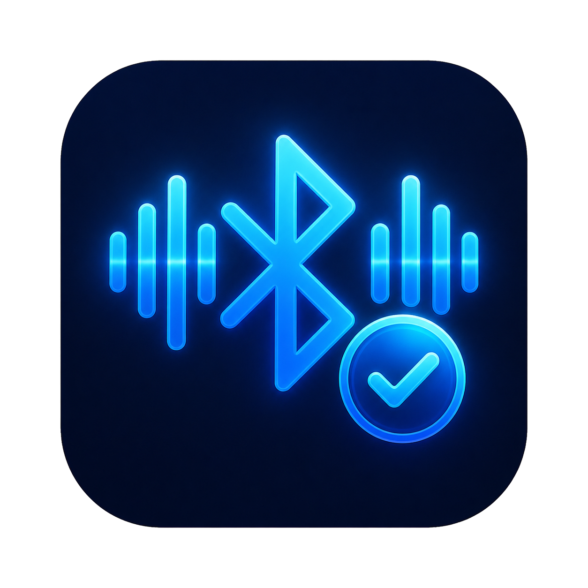
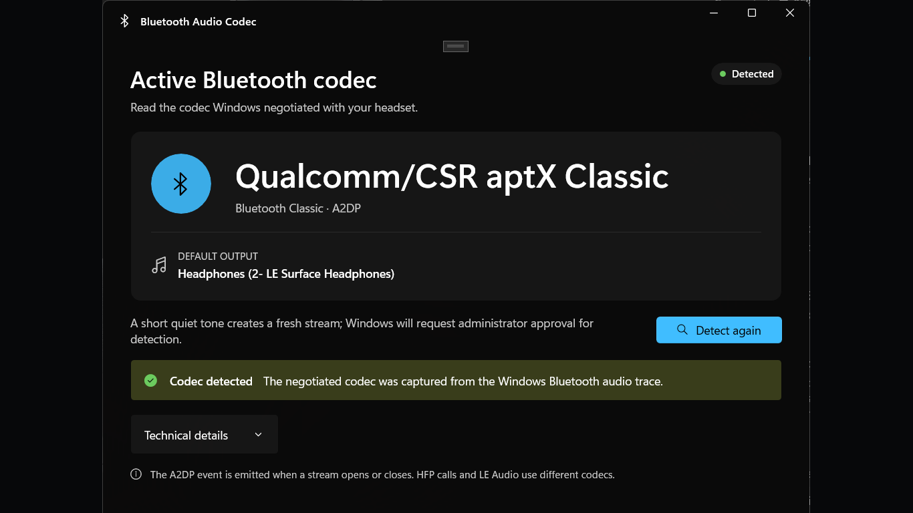
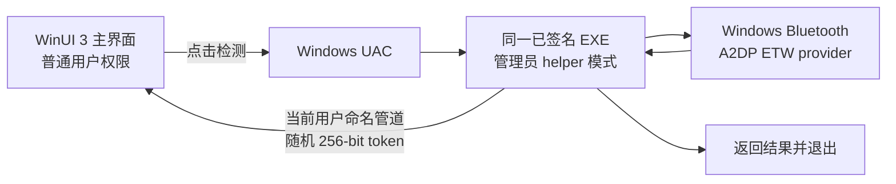

<div align="center">
  

# Bluetooth Audio Codec

**查看 Windows 与蓝牙耳机当前协商使用的 Bluetooth Classic A2DP 编解码器。**

SBC · AAC · aptX · aptX HD · aptX Low Latency · LDAC · LHDC · 更多

Windows 10/11 · WinUI 3 · x64/ARM64
</div>



## 下载安装

### Microsoft Store（推荐）

<a href="https://get.microsoft.com/installer/download/9p8g2cqw77jt?referrer=appbadge" target="_self">
  
</a>

- 商店页面：<https://apps.microsoft.com/detail/9P8G2CQW77JT>
- 支持自动更新，Windows 10（build 19041+）与 Windows 11 的 x64 / ARM64 设备均可安装；
- 也可以用 winget 安装：

```powershell
winget install --source msstore --id 9P8G2CQW77JT
```

### 离线安装包（MSI）

从 [GitHub Releases](https://github.com/A-BenLi06/Bluetooth-Audio-Codec-Viewer-WinUI3/releases)
下载 x64 或 ARM64 的离线 MSI 安装包。自包含单文件发布，无下载器和捆绑组件，
无需另装 .NET Runtime。

## 简介

Bluetooth Audio Codec 是一款专注、现代的 Windows 桌面工具。它监听 Windows
公开的 Bluetooth A2DP ETW 事件，并显示系统与耳机或音箱当前协商使用的音频
编解码器、默认输出设备及底层 codec ID。

检测完全在本机完成。应用不会录制音频、修改蓝牙设置、安装驱动或后台服务，也不会
上传设备信息。

## 功能

- 检测当前 Bluetooth Classic A2DP 编解码器；
- 识别 SBC、AAC、aptX Classic、aptX HD、aptX Low Latency、FastStream、
  LDAC、Samsung Scalable Codec、LHDC 等已知格式；
- 显示标准 codec ID、vendor ID、vendor codec ID、默认输出设备和检测时间；
- 无法识别的编解码器仍会保留其原始数字标识，便于排查；
- 支持 x64 和 ARM64，自包含单文件发布，无需用户另装 .NET Runtime；
- 提供英语、简体中文、繁体中文、日语、法语、西班牙语、葡萄牙语、德语和
  意大利语界面。

## 使用方法

1. 连接蓝牙耳机或音箱，并将其设为当前播放设备。
2. 正常启动应用，无需以管理员身份运行整个界面。
3. 点击 **Detect codec**，在 Windows 弹出提示时批准管理员权限。
4. 应用会播放一段短促、安静的提示音以建立新的 A2DP 串流。
5. 检测到事件后，主卡片会显示当前编解码器和输出设备；展开
   **Technical details** 可查看原始标识。

管理员权限仅用于一次检测。检测结束或取消后，短生命周期 helper 会退出。

## 工作原理



Windows 将蓝牙 codec trace 限制给提升权限的进程，因此检测时必须请求 UAC。
主界面始终保持普通权限；helper 使用仅限当前用户的随机命名管道返回结果，不会常驻。

## 支持范围与限制

- 最低系统版本：Windows 10 版本 2004（build 19041）；
- 支持处理器：x64、ARM64；
- 仅检测 Bluetooth Classic 的 A2DP 播放链路；
- 免提通话使用的 HFP（CVSD/mSBC）不属于 A2DP，不会显示；
- Bluetooth LE Audio 使用不同的事件和 codec 路径，目前不检测 LC3；
- 检测结果来自 Windows 建立或关闭串流时发出的事件。如果没有捕获到事件，请停止
  播放后重新检测，或在检测期间重新连接耳机；
- 厂商驱动和 Windows 版本可能引入新的 ID。未知 ID 会原样显示，但名称可能需要后续
  补充。

## 从源码开发

### 环境要求

- Visual Studio（安装 .NET 桌面开发和 Windows 应用开发相关组件）；
- .NET 10 SDK；
- Windows 10 SDK 10.0.26100 或更高版本；
- 构建安装包时需要 WiX Toolset SDK 6（项目会通过 NuGet 还原 6.0.2）。

### Visual Studio 入口

用 Visual Studio 打开：

```text
BluetoothAudioCodec.WinUI/BluetoothAudioCodec.WinUI.slnx
```

启动项目是 `BluetoothAudioCodec.WinUI.csproj`。选择 `x64` 或 `ARM64` 平台后即可
构建和调试。安装器是独立项目
`BluetoothAudioCodec.Installer/BluetoothAudioCodec.Installer.wixproj`。

### 命令行构建

```powershell
dotnet restore .\BluetoothAudioCodec.WinUI\BluetoothAudioCodec.WinUI.csproj
dotnet build .\BluetoothAudioCodec.WinUI\BluetoothAudioCodec.WinUI.csproj `
    --configuration Release `
    -p:Platform=x64
```

生成本地测试用 x64 和 ARM64 MSI：

```powershell
.\build-store-installer.ps1 -Architecture all -Version 1.0.0
```

输出位于 `artifacts/installer/`。没有受信任代码签名的构建仅供本地测试，不能上传
Microsoft Store。

### 签名发布构建

```powershell
.\build-store-installer.ps1 `
    -Architecture all `
    -Version 1.0.0 `
    -Manufacturer "BenLi06" `
    -CertificateThumbprint YOUR_CERTIFICATE_THUMBPRINT `
    -RequireSigning
```

脚本会先签名并时间戳 EXE，再将它嵌入 MSI，最后签名 MSI；同时生成包含 SHA-256、
签名状态和静默安装命令的 release manifest。Store 发布前的完整步骤见
[STORE_SUBMISSION.md](STORE_SUBMISSION.md)。

## 可选命令行版本

仓库根目录的 `BluetoothAudioCodec.cs` 是独立的 .NET 10 file-based app，适合脚本
或故障排查。请在管理员 PowerShell 中运行：

```powershell
dotnet run .\BluetoothAudioCodec.cs -- --timeout 30
dotnet run .\BluetoothAudioCodec.cs -- --json
dotnet run .\BluetoothAudioCodec.cs -- --watch --no-tone
```

## 项目结构

| 路径 | 内容 |
| --- | --- |
| `BluetoothAudioCodec.WinUI/` | WinUI 3 应用、检测服务和本地化资源 |
| `BluetoothAudioCodec.Installer/` | WiX 6 MSI 安装器 |
| `BluetoothAudioCodec.cs` | 独立命令行检测程序 |
| `build-store-installer.ps1` | x64/ARM64 发布、签名和 MSI 构建脚本 |
| `StoreAssets/` | Store 图标、截图、商品页文本和认证说明 |
| `STORE_SUBMISSION.md` | Microsoft Store MSI/EXE 上架清单 |

## 隐私与安全

- 所有检测和解析均在设备本地进行；
- 不收集遥测，不发送网络请求，不录制或保存音频；
- 不修改蓝牙、音频或系统设置；
- 不安装驱动、Windows 服务或常驻管理员进程；
- 仅在用户主动开始检测时启动提升权限的 helper。

准备公开隐私政策时，请先替换
[StoreAssets/PRIVACY_POLICY.md](StoreAssets/PRIVACY_POLICY.md) 中的支持联系方式占位符。

## Support development

如果 Bluetooth Audio Codec 对你有帮助，可以通过以下平台支持后续开发：

- [Ko-fi](https://ko-fi.com/benli06)
- [爱发电](https://afdian.com/a/benli06)

支持完全自愿，不会解锁应用功能或内容。

## English overview

Bluetooth Audio Codec is a focused WinUI 3 utility that reports the active
Bluetooth Classic A2DP codec negotiated by Windows. It is available on the
[Microsoft Store](https://apps.microsoft.com/detail/9P8G2CQW77JT) and as
offline MSI installers from GitHub Releases. It recognizes SBC, AAC,
aptX variants, LDAC, LHDC, and selected vendor codecs, while retaining raw IDs
for unknown values. Detection is local and does not record audio, change system
settings, install a driver or service, or transmit device information.

Windows restricts the Bluetooth codec ETW trace to elevated processes. The UI
therefore stays unelevated and starts a short-lived elevated helper only after
the user begins a detection. The helper returns its result through an
authenticated current-user named pipe and exits.

The app supports Windows 10 build 19041 or later on x64 and ARM64. It inspects
Bluetooth Classic A2DP only; HFP calls and Bluetooth LE Audio use different
codec paths and are outside its scope.

## License and trademarks

Copyright © 2026 BenLi06. This project is available under the
[MIT License](LICENSE).

Bluetooth trademarks belong to Bluetooth SIG, Inc. Other product names and
trademarks belong to their respective owners. This project is not affiliated
with or endorsed by those trademark owners.
